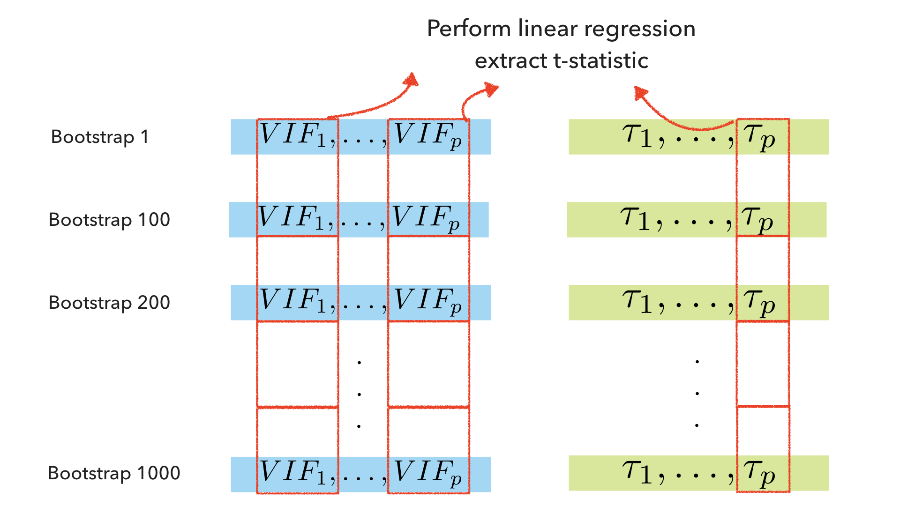

```{r setup, include=FALSE}
knitr::opts_chunk$set(echo = TRUE)
library(tidyverse)
library(mcvis)
library(corrplot)
library(car)
library(emo)
library(sjPlot)
theme_set(theme_classic(18))
```


## Acknowledgement

This is joint work with Chen Lin (Fudan Univeristy) and Prof Samuel Mueller (Sydney University).


.pull-left[

<center>

</center>


<center>

</center>

]

.pull-right[

<center>

</center>

<center>

</center>

]

---

## Cricketers' career batting statistics


+ Cricket is a bat-and-ball game. 
+ The aim of a batsman is to score as many runs as possible from balls faced.
+ A batsman with more scores of "4" and "6" is considered to be more aggressive.

```{r, include = FALSE}
clean_test_batting_career = readr::read_csv("./clean_test_batting_career.csv")

X = clean_test_batting_career %>% 
  dplyr::mutate(hs_num = hs %>% stringr::str_extract("\\-*\\d+\\.*\\d*") %>% as.integer()) %>% 
  dplyr::select_if(is.numeric) %>% 
  na.omit() %>% 
  dplyr::transmute(
    # log_ave = log10(ave),
    log_sr = log10(strike_rate),
    log_bf = log10(balls_faced/100),
    # log_outs = log10(inns - not_out),
    log_fours = log10(fours + 1L),
    log_sixes = log10(sixes + 1L),
    log_ducks = log10(ducks + 1L),
    log_hs = log10(hs_num),
    # log_hcentury = log10(half_century + 1L),
    log_runs = log10(runs)
    # log_inns = log10(inns + 1L),
    # log_not_out = log10(not_out + 1L)
    ) %>% 
  dplyr::select(log_sr, log_runs, log_bf, everything())
```


```{r}
glimpse(X)
```


---

## Interesting relationships in the data

There is a causual relationship: 

$$\text{strike rate} = \frac{\text{runs}}{\text{balls faced}}, \qquad \text{or equvalently, } \qquad \texttt{log_sr} = \texttt{log_runs} - \texttt{log_bf}.$$

.center[
```{r, fig.height=5, fig.width=5, echo = FALSE}
X %>% 
  ggplot(aes(x = log_sr,
             y = log_runs - log_bf)) +
  geom_point() +
  geom_abline(slope = 1, intercept = 0, colour = "red")
```
]


---

## What is multi-collinearity?

When one (or more) independent variables in a linear regression model can be linearly predicted from other predictors with a high degree of accuracy.

```{r}
M1 = lm(log_sr ~ ., data = X)
broom::tidy(M1)
```


.footnote[In other words, the columns of $X$ are almost linear dependent.]

---

## Consequence of multicollinearity

Numerical instability is a typical sympton of multicollinearity. 

```{r, echo = FALSE}
M2 = lm(log_sr ~ . -log_bf, data = X)
M3 = lm(log_sr ~ . -log_runs, data = X)
sjPlot::tab_model(M1, M2, M3,
                  # show.intercept = FALSE, 
                  show.ci = FALSE, 
                  show.se = TRUE, 
                  show.r2 = FALSE, 
                  show.obs = FALSE,
                  dv.labels = c("Both", "Runs only", "BF only"))
```


---

## High correlation = high multicollinearity?


.pull-left[
```{r, echo = FALSE, fig.width = 8, fig.height = 8}
corrplot::corrplot.mixed(
  cor(X), 
  upper = "square")
```
]


.pull-right[
+ The causal variables are not the most highly correlated.
+ Identifying high correlation does not always identify high multicollinearity.

.blockquote[
Diagnosing multicollinearity requires specialised statistics.
]
]

---
class: segue

Existing methodologies

---

## Common measures 

1. Variance inflation factors (VIFs) was introduced in Marquaridt (1970): 

$$VIF_j = \frac{1}{1 - R^2_j}, \qquad j = 1, \dots, p,$$
where $R^2_j$ is the coefficient of determination when the $\boldsymbol{x}_j$ independent variable is treated as a response variable against the remaining $p-1$ independent variables. 

A larger value of $VIF_j$ implies greater the cause of multicollinearity by the variable $\boldsymbol{x}_j$.

2. Eigenvalues of $X^\top X$ (the "uncentered covariance matrix"), $\lambda_{1}\geq\lambda_{2}\geq{\ldots}\geq{\lambda_{p}}\geq 0$. A smaller value of $\lambda_{p}$ suggests there may exist an approximate linear relationship between one or more subsets of variables *, (Stewart 1987).

.footnote[Linear dependence means determinant is 0, which means the product of all eigenvalues is 0.]


---

## Relationships between the two measures

Suppose that $X$ is standardised to have mean 0 and variance 1, and decompose $(X^\top X)^{-1}$ into $G\operatorname{diag}(1/\lambda_{1},\dots,1/\lambda_{p}){G^\top }$, then:

.center[
$\left(\begin{array}{ccc} VIF_1 \\\vdots \\VIF_p \end{array}\right)=\left(\begin{array}{ccc}g_{11}^2 & \cdots & g_{1p}^2 \\ \vdots & \ddots & \vdots \\ g_{p1}^2 & \cdots & g_{pp}^2 \end{array} \right) \left(\begin{array}{ccc} \tau_{1} \\ \vdots \\ \tau_{p} \end{array} \right)$,
]

where $\tau_{j}=1/\lambda_{j}, \quad j=1,\ldots,p$. 


This relationship tells us how these diagnostic measures are related, but does **not** tell us about which variable $\boldsymbol{x}_j$ causes MC.


---

## Identifying the MC-causing variable 

+ The previous relationship tells us that the surrogate measure of MC, $\tau_p$ is linearly related to the VIF's. 
+ But each VIF is related to each original variable. 

.blockquote[
By understanding the linearity between $\tau_p$ and each of the VIF's (simple), we can get a better diagnosis of which variables are causing MC (complex).
]

---
class: segue

mcvis method
---

<center>

</center>

---
<center>

</center>

---
<center>

</center>

---
<center>

</center>

---
<center>

</center>

---
<center>

</center>

---
<center>

</center>

---
<center>

</center>

---
class: segue

Results

---

## Applying VIF

```{r}
M1 %>% 
  car::vif() %>% 
  round(2)
```

The top three variables for causing multicollinearity are: 

```{r, include = FALSE, eval = FALSE}
keywords <- emo::ji_keyword
keywords <- keywords[lengths(keywords) > 1]
emojis <- purrr::map_chr(keywords, function(x) paste0(emo::ji_name[x], collapse = ""))
cat(paste(names(emojis), ": ", emojis, collapse = "\n"))

emo::ji_find("mark")
emo::ji("x")
emo::ji("white_check_mark")


```

+ `log_runs` `r emo::ji("white_check_mark")`
+ `log_fours` `r emo::ji("x")`
+ `log_bf` `r emo::ji("white_check_mark")`

---

## MC-index computation

```{r}
library(mcvis)
set.seed(135)
mcvis_result = mcvis(X)
round(mcvis_result$MC[ncol(X),], 2)
```

+ `log_runs` `r emo::ji("white_check_mark")`
+ `log_sr` `r emo::ji("white_check_mark")`
+ `log_bf` `r emo::ji("white_check_mark")`

---

## mcvis visualisation

.center[
```{r, fig.width = 10, fig.height = 5}
ggplot_mcvis(mcvis_result)
```
]

---

## Extensions

.center[
```{r, fig.width = 10, fig.height = 5}
ggplot_mcvis(mcvis_result, eig_max = 7)
```
]

---

## Final remarks

+ mcvis provides a new MC-index and a visualisation of multicollinearity in linear regression.
+ mcvis builds on top of classical statistics under a resampling framework and uncovers new sources of collinearity.
+ Learn more from:

  - R package (GitHub): [leaffur/mcvis](https://github.com/leaffur/mcvis)
  - Python package (GitHub): [kevinwang09/mcvispy](https://github.com/kevinwang09/mcvispy)
  - Email: [samuel.mueller@sydney.edu.au](mailto:samuel.mueller@sydney.edu.au)
	- Twitter: [@KevinWang009](https://twitter.com/KevinWang009) and [@SamuelMuller74](https://twitter.com/SamuelMuller74)
---


## Bibliography

---