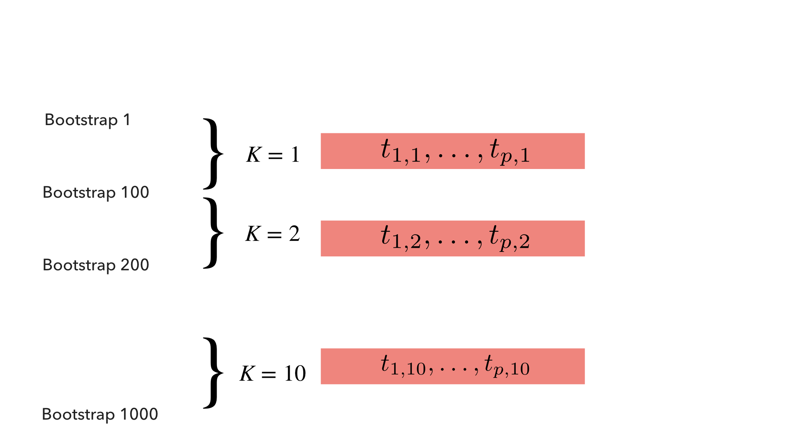

```{r setup, include=FALSE}
knitr::opts_chunk$set(echo = TRUE, fig.retina = 2)
library(tidyverse)
library(mcvis)
library(corrplot)
library(car)
library(emo)
library(sjPlot)
library(ggcorrplot)
library(icon)
theme_set(theme_classic(18))
```


## Acknowledgement


This is joint work with Chen Lin (Fudan Univeristy) and Prof Samuel Mueller (Sydney University).

<br>


.pull-left[

<center>

</center>


<center>

</center>

]

.pull-right[

<center>

</center>

<center>

</center>

]

---

## Cricketers' career batting statistics


+ Cricket is a bat-and-ball game. 
+ The aim of a batsman is to score as many **runs** as possible before getting **out**.

```{r, include = FALSE}
clean_test_batting_career = readr::read_csv("./clean_test_batting_career.csv")

set.seed(10)

X = clean_test_batting_career %>% 
  dplyr::mutate(hs_num = hs %>% stringr::str_extract("\\-*\\d+\\.*\\d*") %>% as.integer()) %>% 
  # dplyr::select_if(is.numeric) %>% 
  # dplyr::filter(career_end >= 2010) %>%
  # dplyr::sample_n(size = 50) %>% 
  na.omit() %>%
  dplyr::transmute(
    log_ave = log10(ave),
    log_outs = log10(inns - not_out),
    log_fours = log10(fours + 1L),
    log_sixes = log10(sixes + 1L),
    log_ducks = log10(ducks + 1L),
    log_hs = log10(hs_num),
    log_runs = log10(runs),
    log_100 = log10(century + 1L)
    ) %>% 
  dplyr::select(log_runs, log_ave, log_outs, everything())
```

```{r}
glimpse(X)
```


---

## Interesting feature in this data

There is a causal relationship: 

$$\text{batting ave} = \frac{\text{runs}}{\text{no. of outs}}, \qquad \text{or equivalently, } \qquad \texttt{log_runs} = \texttt{log_ave} + \texttt{log_outs}.$$


<br>


.center[
```{r, fig.height=5, fig.width=5, echo = FALSE}
X %>% 
  ggplot(aes(x = log_runs,
             y = log_ave + log_outs)) +
  geom_point() +
  geom_abline(slope = 1, intercept = 0, colour = "red")
```
]


---

## What is multi-collinearity (MC)?

MC occurs when columns of $X$ are linear dependent (exactly or approximately). 

```{r}
M1 = lm(log_100 ~ ., data = X)
broom::tidy(M1)
```


---

## Consequence of multi-collinearity

+ Numerical instability is a typical sympton of MC. 


```{r, echo = FALSE}
M2 = lm(log_100 ~ . -log_runs, data = X)
M3 = lm(log_100 ~ . -log_ave, data = X)

sjPlot::tab_model(M1, M2, M3,
                  # show.intercept = FALSE, 
                  show.ci = FALSE, 
                  show.se = TRUE, 
                  show.r2 = FALSE, 
                  show.obs = FALSE,
                  dv.labels = c("Include all", "Remove log_runs", "Remove log_ave"))
```


+ We will proceed with rounding all variables to 2 significant figures. 

```{r, include = FALSE}
X = X %>% 
  dplyr::mutate_all(signif, 3)
```


---

## High correlation $\neq$ multicollinearity


.pull-left[
```{r, echo = FALSE, fig.width = 9, fig.height = 9}
ggcorrplot(cor(X), 
          type = "upper",
           outline.col = "white",
          lab = TRUE, 
          lab_size = 8, 
          tl.cex = 20)
```
]


<br>

<br>

.pull-right[
+ By definition, it is the linear combination of variables that causes MC.
+ The causal variables are not the most highly correlated.
+ Thus, identifying high correlation does not always identify sources of MC.

.blockquote[
Diagnosis of multicollinearity requires specialised statistics.
]
]

---
class: segue

# Existing methodologies

---

## 1. Variance inflation factors (VIFs)

Introduced in Marquaridt (1970): 

$$VIF_j = \frac{1}{1 - R^2_j}, \qquad j = 1, \dots, p,$$
where $R^2_j$ is the coefficient of determination when the $\boldsymbol{x}_j$ independent variable is treated as a response variable against the remaining $p-1$ independent variables. 

A **larger** value of $VIF_j$ implies $\boldsymbol{x}_j$ can be highly predicted by other variables, and thus implies higher cause of MC by that variable.

--

```{r}
M1 = lm(log_100 ~ ., data = X)
M1 %>% car::vif() %>% round(2)
```

+ Using a threshold of 5 endorsed by Sheather (2009), 5 MC-causing variables are identified.

<!-- The top four variables for causing multicollinearity are:  -->

<!-- `r emo::ji("white_check_mark")` `log_runs` -->
<!-- `r emo::ji("white_check_mark")` `log_outs` -->
<!-- `r emo::ji("x")` `log_fours`  -->
<!-- `r emo::ji("white_check_mark")` `log_ave`  -->


---

## 2.Eigenvalues of $X^\top X$ 

Eigenvalues of the "uncentered covariance matrix" $\lambda_{1}\geq\lambda_{2}\geq{\ldots}\geq{\lambda_{p}}\geq 0$ offers a more linear algebra interpretation of MC. 

A **smaller** value of $\lambda_{p}$ produces a matrix determinant closer to 0, which implies linear dependence in $X$ and thus MC (Stewart 1987).  

```{r}
Xmat = X %>% as.data.frame() %>% as.matrix()
eigen = svd(t(Xmat) %*% Xmat)
round(eigen$d, 3)
```


Note: this only implicates the existence of MC, not which variable causes MC. 


---

## Relationships between the two measures

Suppose that $X$ is standardised to have mean 0 and variance 1, and we decompose $(X^\top X)^{-1}$ into $G\operatorname{diag}(1/\lambda_{1},\dots,1/\lambda_{p}){G^\top }$, then:

.center[
$\left(\begin{array}{ccc} VIF_1 \\\vdots \\VIF_p \end{array}\right)=\left(\begin{array}{ccc}g_{11}^2 & \cdots & g_{1p}^2 \\ \vdots & \ddots & \vdots \\ g_{p1}^2 & \cdots & g_{pp}^2 \end{array} \right) \left(\begin{array}{ccc} \tau_{1} \\ \vdots \\ \tau_{p} \end{array} \right) = (G \otimes G) \boldsymbol{\tau}$,
]

where $\tau_{j}=1/\lambda_{j}, \quad j=1,\ldots,p$. 

.blockquote[
.center[
Larger $\tau_p$ value indicates great MC.  
]
]

--

+ It will be great if we have a formula of the form $\tau_p = f(VIF_1, \dots, VIF_p)$ to reveal the relationship between every variable $\boldsymbol{x}_j$ and the cause of MC, $\tau_p$. 

+ But $G \otimes G$ is generally not invertible.

---
class: segue

# The mcvis method

---

## mcvis


<br>
<br>
<br>

.blockquote[
.center[
We perform linear regression between $\tau_p$ and every VIF.
]
]

+ By quantifying the linearity between $\tau_p$ and VIFs, we can diagnose MC-causing variables.

+ How can we generate multiple "observations" of both $\tau_p$ and VIFs?

+ Sampling!


---

<center>

</center>

---
<center>

</center>

---
<center>

</center>

---
<center>

</center>

---
<center>

</center>

---
<center>

</center>

---
<center>

</center>

---
<center>

</center>

---
class: segue

# The `mcvis` package


```{r, include = FALSE, eval = FALSE}
# keywords <- emo::ji_keyword
# keywords <- keywords[lengths(keywords) > 1]
# emojis <- purrr::map_chr(keywords, function(x) paste0(emo::ji_name[x], collapse = ""))
# cat(paste(names(emojis), ": ", emojis, collapse = "\n"))
# 
# emo::ji_find("mark")
# emo::ji("x")
# emo::ji("white_check_mark")
```

---

## 1. MC-index

```{r}
library(mcvis)
set.seed(13)
p = ncol(X)
mcvis_result = mcvis(X[,-p])
round(mcvis_result$MC[p-1,], 2)
```

---

## 2. MC visualisation

.center[
```{r, fig.width = 10, fig.height = 5}
ggplot_mcvis(mcvis_result)
```
]

---

## 3. Shiny app for interactive exploration of data

<center>

</center>

---

## Extension work: Multiple $\tau$'s

.center[
```{r, fig.width = 10, fig.height = 5}
ggplot_mcvis(mcvis_result, eig_max = 7)
```
]

---

<!-- ## Applying VIF 2 (DELETE) -->

<!-- ```{r} -->
<!-- M4 = lm(log_hs ~ . -log_outs-log_runs, data = X) -->
<!-- M5 = lm(log_hs ~ . -log_runs, data = X) -->


<!-- list_M = list(M1, M2, M3, M4, M5) -->

<!-- list_M %>%  -->
<!--   purrr::map(car::vif) %>%  -->
<!--   purrr::map(round, 2) -->
<!-- ``` -->

<!-- The top three variables for causing multicollinearity are:  -->

<!-- + `log_runs` `r emo::ji("white_check_mark")` -->
<!-- + `log_outs` `r emo::ji("white_check_mark")` -->
<!-- + `log_ave` `r emo::ji("white_check_mark")` -->
<!-- + `log_fours` `r emo::ji("x")` -->

## Final remarks

+ mcvis provides a new MC-index and a visualisation of multicollinearity in linear regression.
+ mcvis builds on top of classical statistics under a resampling framework and uncovers new sources of collinearity with an understanding of variability.

+ Learn more from:

  - `r icon::fa('r-project')` [leaffur/mcvis](https://github.com/leaffur/mcvis)
  - `r icon::fa('python')` [kevinwang09/mcvispy](https://github.com/kevinwang09/mcvispy)
  - `r icon::fa('envelope')` [samuel.mueller@sydney.edu.au](mailto:samuel.mueller@sydney.edu.au)
	- `r icon::fa('twitter')` [@KevinWang009](https://twitter.com/KevinWang009) and [@SamuelMuller74](https://twitter.com/SamuelMuller74)
---


## Bibliography
