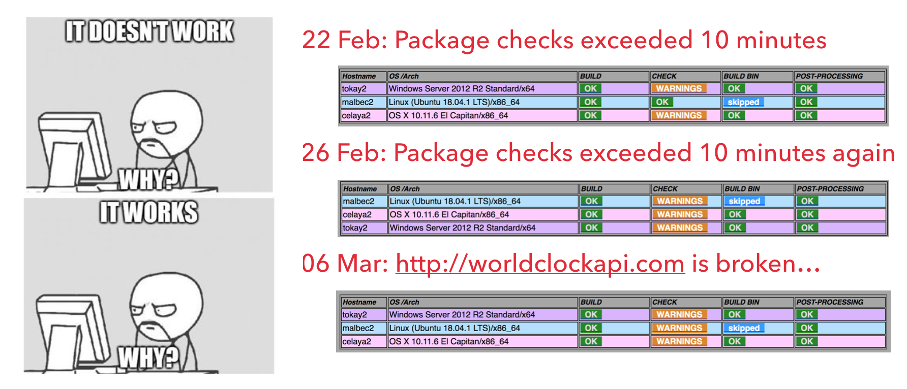
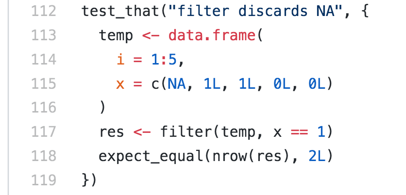

```{r, echo = FALSE, message=FALSE}
knitr::knit_hooks$set(error = function(x, options) {
  paste0("<pre style=\"color: red;\"><code>", x, "</code></pre>")
})
library(tidyverse)
```
class: segue
# Acknowledgement

Credits go to Garth, Dario and Mark for their advice. 

I do not believe in coding via talking, you have to struggle on your own to find a package building pipeline that suits your own style.

---

# Demystifying R package

Loosely speaking, a `R` package is simply a folder with scripts*.


On my laptop:

```{r}
.libPaths() %>% list.files() %>% head()
.libPaths() %>% paste0("/dplyr") %>% list.files()
```

---
class: segue-yellow

# Demo 

https://github.com/kevinwang09/hello

### `roxygen2`: managing the folders, namespaces and documentations

### `devtools`: building, checking and installing the package


---

## Building a package is more than just coding

+ Designs, organisations, dependencies, testing, documentations and debugging. 

+ Getting a package to install only takes 1 commit. But polishing the package takes much longer:
  
    - `SmokyScotch`: 55 commits, 1 branch
    - `mcvis`: 47 commits, 2 branches
    - `APES`: 72 commits, 2 branches
    - `scMerge`: 152 commits, 4 branches

---

## Packages of different standards

  1. A `laptop` package
    - Write your code using `roxygen2`.
  1. A `GitHub` package
    - Make a GitHub repository and push.
  1. A CRAN package
    - `devtools::check()`
  1. A Bioconductor package
    - `BiocCheck::BiocCheck()`

---
class: segue-yellow

# Demo 

https://github.com/kevinwang09/hello

### `devtools::build()` is easy 
### `devtools::check()` is much harder
---

## Making a CRAN package

+ Everyone must pass this check before being put on CRAN


.content-box-red[Error: the worst of all.]

.content-box-yellow[Warning: less severe, but also prevents pass.] 

.content-box-green[Note: You should check these.]

<center>

</center>

---
class: segue-yellow

### Demo: `mcvis` - friday branch

---
## Making a Bioconductor package

+ Compare to CRAN, Bioconductor has a greater focus on documentations, examples and vignettes, reproducibility and coding styles.

+ GitHub + Bioc git + virtual machine checker + human reviewer + docker.

+ Development must be done with respect to the **development branch** of Bioconductor AND the **unreleased development version** of `R`

+ `BiocCheck::BiocCheck()` checks for

    * if maintainer is registered with BioC
    * coding documentations (e.g. `\dontrun{}` is forbidden)
    * coding style (e.g. recommended function length is less than 50 lines)
    

---

## Bioconductor build report: a virtual machine to check your package

<center>

</center>

---

class: segue

## Other useful tools

---

## `testthat`

+ A "test" folder is set up with a collection of test scripts. So that you can test if the outputs are genuinely matching with your pre-computed results.

<center>

</center>


---

## Travis: continuous integration

+ `.travis.yml` controls how a virtual machine should be set up to build and check your package.

+ Travis build is triggered by commits.

+ Travis is publically accountable? https://travis-ci.org/tidyverse/readr.

+ But configuring it for more complex projects with multiple environment variables and flags can be time consuming. https://travis-ci.org/SydneyBioX/scMerge/builds.

---

## Pros and cons of Travis

.content-box-green[Travis is a great tool to ensure robustness of your package.]

.content-box-red[But if you have a complex set-up, then be prepared to spend a lot of time on it.]

<br>

.content-box-green[`travis.org` is free for public GitHub repos.]

.content-box-red[`travis.com` is free for private GitHub repos for first 50 triggers.]

<br>

.content-box-green[Travis does not support R for Windows.]

.content-box-red[Travis has some problems with support for R-devel.]

.content-box-yellow[Travis is community maintained] E.g. Travis only updated instructions on BioC 3.9 installation at [my request](https://github.com/travis-ci/travis-build/pull/1710) last week. 

---


## Some resources

+ Read http://r-pkgs.had.co.nz/
+ StackExchange
+ `tidyverse` packages on GitHub
+ GitHub issues pages
+ Bioconductor style guide 
+ ~~Garth~~ 
+ [Using Travis for R](https://blog.rstudio.com/2016/03/09/r-on-travis-ci/)
+ Praying for divine intervention
+ [Building `blogdown` using `Travis`](https://bookdown.org/yihui/blogdown/travis-github.html) (A massive overkill, but okay...)